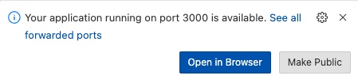
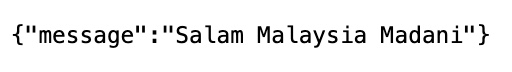
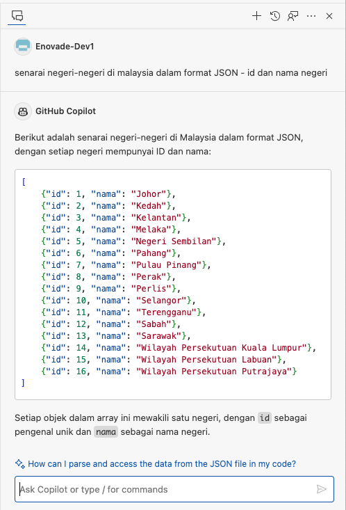
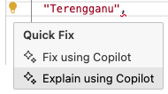
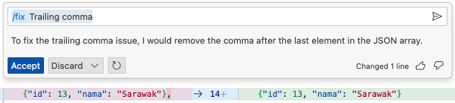
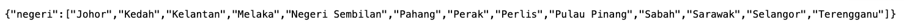
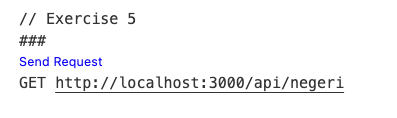
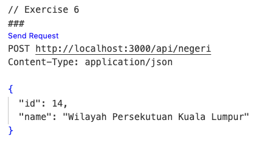
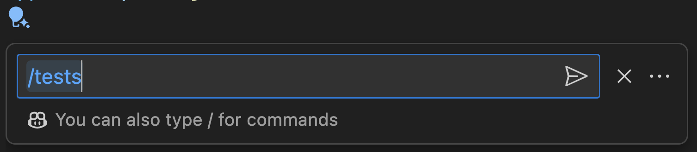
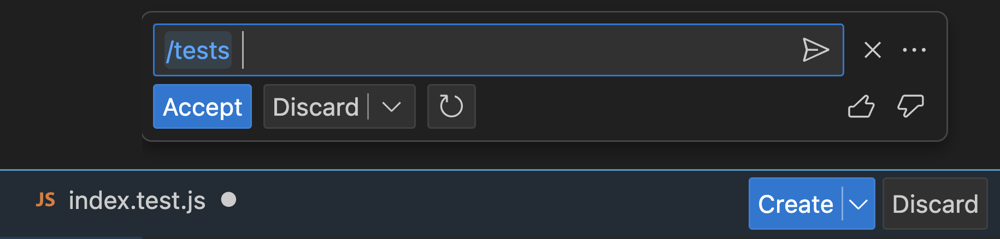

## Workshop exercises

### Core exercise

The following exercises will help you get started with GitHub Copilot. You must have completed the [environment readiness](<./1. environment readiness.md>) before starting these steps.


### Step by step instructions

<details>
<summary>Exercise 1: Initialling Node.js application</summary>

---

**Starting Point**: You should have the repo open in Codespaces (or VS Code)

1. Press ```CTRL + ` ``` to open the terminal window in VS Code if it is not already open.

2. Enter ```npm install``` in the terminal window and press **ENTER** to install the required dependencies. TIP: Ignore any issues displayed after you run this command.

</details>

<details>
<summary>Exercise 2: Create first REST API endpoints using GitHub Copilot</summary>

---

1. Open file: ```app.js```

2. At the file, scroll down to where you find the ```// TODO: Exercise 2``` comment

3. **Replace** the comment to provide context to GitHub Copilot on what you want assistance to do. Try adding the following comment and press **ENTER** to generate a suggestion. 

```javascript
// create an Express REST API server that return JSON data i.e "Salam Malaysia Madani!!" when a user sends a GET request to the server's /api/ path
```

The following is the sample suggested code

```javascript
app.get('/api/', (req, res) => {
    res.json("Salam Malaysia Madani!!");
});
```

Let's start by running the application to learn what it does.

4. Enter ```npm start``` in the terminal window and press **ENTER** to run the application.

5. In the pop-up window that appears in the bottom right corner of the Codespace window, click the **Open in Browser** button. This will securely map port 3000 from the Codespace environment (if you're using Codespaces) to your local browser.



6. At the browser add the following path ```/api``` and press **ENTER** to run the API endpoint. You should get the following result. 



7. Close the browser window for now and return to the Codespace window.

8. Ensure your focus is in the terminal window and press ``` CTRL + C ``` to stop the application.

</details>

<details>
<summary>Exercise 3: Creating JSON Data using GitHub Copilot</summary>

---

>Let's create a JSON data - list of Malaysian's States using GitHub copilot chat in **Malay Language**

1. Create a new file: ```negeri.json```

2. Click  **GitHub Copilot Chat** icon

3. Add the following text and press **ENTER** 

```
senarai negeri-negeri di malaysia dalam format JSON - id dan nama negeri
```

4. The following are the sample suggested result 



5. Copy and paste the result to **negeri.json** file

</details>

<details>
<summary>Exercise 4: Fixing error using GitHub Copilot</summary>

---

>Let's fix syntax error using GitHub copilot

1. Open **negeri.json** file

2. Delete all the JSON value starts with ```Wilayah Persekutuan...``` as per the following

```JSON
[
    {"id": 1, "nama": "Johor"},
    {"id": 2, "nama": "Kedah"},
    {"id": 3, "nama": "Kelantan"},
    {"id": 4, "nama": "Melaka"},
    {"id": 5, "nama": "Negeri Sembilan"},
    {"id": 6, "nama": "Pahang"},
    {"id": 7, "nama": "Pulau Pinang"},
    {"id": 8, "nama": "Perak"},
    {"id": 9, "nama": "Perlis"},
    {"id": 10, "nama": "Selangor"},
    {"id": 11, "nama": "Terengganu"},
    {"id": 12, "nama": "Sabah"},
    {"id": 13, "nama": "Sarawak"},
]
```

3. We can see in Codespaces that there is an error at the end of line 14 - ```},```

4. Move the cursor to the error and click  or  **Show Code Actions** icon. 

5. Select **Explain using Copilot** and read the error explanation at **GitHub copilot chat**



6. Move the cursor to the error and click  or  **Show Code Actions** icon again and select **Fix using Copilot**, view the possible suggestion and click **Accept**




</details>

<details>
<summary>Exercise 5: Create CRUD (Read) API endpoints from JSON data using GitHub Copilot</summary>

---

>Let's create a REST API endpoints to read data from the JSON file

1. Open file: ```app.js```

2. At the file, scroll down to where you find the ```// TODO: Exercise 5``` comment

3. **Replace** the comment to provide context to GitHub Copilot to create a REST API endpoints to read data from the JSON file. Try adding the following comment and press **ENTER** to generate a suggestion. 

```javascript
// create a route in the Express server that returns the JSON data from the "negeri.json" file when a user sends a GET request to the server's /api/negeri path
```

2. The following is the sample suggested code

```javascript
const negeri = require('./negeri.json');
app.get('/api/negeri', (req, res) => {
    res.json(negeri);
});
```
---

>Let's start by running the application to learn what it does.

3. Enter ```npm start``` in the terminal window and press **ENTER** to run the application.

4. In the pop-up window that appears in the bottom right corner of the Codespace window, click the **Open in Browser** button. This will securely map port 3000 from the Codespace environment (if you're using Codespaces) to your local browser.


5. At the browser add the following path ```/api/negeri``` and press **ENTER** to run the API endpoint. You should get the following result. 



or

7. Open file: ```uji.http```, scroll down to where you find the ```// Exercise 5``` comment, click ```Send Request``` to execute GET request to API endpoints



8. An output window will display JSON data

7. At the terminal window, press ``` CTRL + C ``` to stop the application.

</details>

<details>
<summary>Exercise 6: Create CRUD (Create) API endpoints to JSON data using GitHub Copilot</summary>

---

>Let's create a REST API endpoints to add a data to the JSON file

1. Open file: ```app.js```

2. At the file, scroll down to where you find the ```// TODO: Exercise 6``` comment

3. **Replace** the comment to provide context to GitHub Copilot to create a REST API endpoints to add data to the JSON file. Try adding the following comment and press **ENTER** to generate a suggestion. 

```javascript
// create a POST request route in the Express server that add a new state as JSON object to the JSON data array from the "negeri.json" file and save the file
```

2. The following is the sample suggested code

```javascript
app.use(express.json());
app.post('/api/negeri', (req, res) => {
    fs.readFile('negeri.json', 'utf8', (err, data) => {
        if (err) {
            console.error(err);
            res.status(500).json({ error: 'Internal Server Error' });
        } else {
            const negeri = JSON.parse(data);
            negeri.push(req.body);
            fs.writeFile('negeri.json', JSON.stringify(negeri), (err) => {
                if (err) {
                    console.error(err);
                    res.status(500).json({ error: 'Internal Server Error' });
                } else {
                    res.json({ message: 'State added successfully' });
                }
            });
        }
    });
});
```
---

>Let's start by running the application to learn what it does.

3. Enter ```npm start``` in the current terminal window and press **ENTER** to run the application.

4. Open file: ```uji.http```

5. At the file, scroll down to where you find the ```// Exercise 6``` comment, click ```Send Request``` to execute POST request to API endpoints



6. An output window will display the following similar result

```
HTTP/1.1 200 OK
X-Powered-By: Express
Content-Type: application/json; charset=utf-8
Content-Length: 38
ETag: W/"26-ZESQLMmbZebMQs27fAztX4eUBLc"
Date: Wed, 21 Feb 2024 05:30:38 GMT
Connection: close

{
  "message": "State added successfully"
}
```

6. Open **negeri.json** file and verify that the new entry listed in the list

or

7. Open file: ```uji.http```, scroll down to where you find the ```// Exercise 5``` comment, click ```Send Request``` to execute GET request to API endpoints


8. An output window will display JSON data with the new added entry

</details>

<details>
<summary>Exercise 7: Adding Unit Test for API endpoints using GitHub Copilot</summary>

---

>Let's create a Unit Test for the REST API endpoints.

1. Open **app.js**, select all the REST API routes, press ```CTRL + I``` to open **GitHub Copilot Chat**



3. Type **/tests** and press **ENTER**.



4. Press **Accept** to automatically create a test file: **app.test.js**

5. The following is the sample suggested code:

```javascript
const fs = require('fs');
const request = require('supertest');
const app = require('./app');

describe('app.js', () => {
  describe('GET /api/', () => {
    it('should return "Salam Malaysia Madani!!"', async () => {
      const response = await request(app).get('/api/');
      expect(response.status).toBe(200);
      expect(response.body).toBe('Salam Malaysia Madani!!');
    });
  });

  describe('GET /api/negeri', () => {
    it('should return the JSON data from negeri.json', async () => {
      const response = await request(app).get('/api/negeri');
      expect(response.status).toBe(200);
      expect(response.body).toEqual(expect.any(Array));
    });
  });

  describe('POST /api/negeri', () => {
    it('should add a new state to negeri.json', async () => {
      const newNegeri = { name: 'New State' };
      const response = await request(app)
        .post('/api/negeri')
        .send(newNegeri);
      expect(response.status).toBe(200);
      expect(response.text).toBe('State added successfully');

      // Verify that the new state is added to negeri.json
      const data = fs.readFileSync('negeri.json', 'utf8');
      const negeri = JSON.parse(data);
      expect(negeri).toContainEqual(newNegeri);
    });

    it('should return 500 Internal Server Error if file reading or writing fails', async () => {
      // Mock fs.readFile to simulate an error
      jest.spyOn(fs, 'readFile').mockImplementation((path, encoding, callback) => {
        callback(new Error('File read error'));
      });

      const newNegeri = { name: 'New State' };
      const response = await request(app)
        .post('/api/negeri')
        .send(newNegeri);
      expect(response.status).toBe(500);
      expect(response.text).toBe('Internal Server Error');

      // Restore the original implementation of fs.readFile
      fs.readFile.mockRestore();
    });
  });
});
```

6. Press ```CTRL + ` ``` to open the terminal window in codespaces if it is not already open.

7. Enter ```npm test ``` to run the test and verify the test result.

</details>


---


>Hopefully your application is working! Remember, GitHub Copilot is probabilistic so you may not get the exact same code suggestions as we did. If you're not happy with the suggestions, you can always press **CTRL + Z** to undo the changes and try again.


#### What's next?
You're now ready to start the [challenge exercises](<./3. challenge exercises.md>) to see how you can leverage the power of GitHub Copilot to solve a number of challenges yourself.
