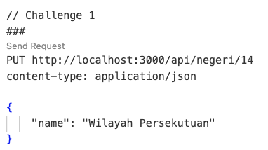
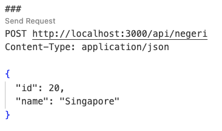
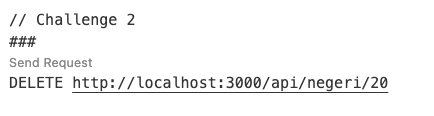

# Challenge Exercises

Now you've had an opportunity to get started using GitHub Copilot, we have a number of challenges for you to attempt. Remember the goal here is not to test your programming abilities but rather, see how you can use GitHub Copilot to help you complete these tasks. Even if you're not a developer, you may be surprised how Copilot can help you be successful with these challenge.


<details>
<summary>Challenge #1: Adding CRUD (Update) API endpoints from JSON data using GitHub Copilot</summary>

---

> To Update data from **"Wilayah Persekutuan Kuala Lumpur"** to **"Wilayah Persekutuan"**

1. Open file: ```app.js```

2. At the file, scroll down to where you find the ```// TODO: Challenge #1``` comment

3. **Replace** the comment to provide context to GitHub Copilot to create a REST API endpoints to update data to the JSON file. Try adding the you own comment and press **ENTER** to generate a suggestion.

**Prompt Example:** ```// create a PUT request route in the Express server that update name based on ID from the "negeri.json" file and save the file ```

sample code:

```
app.put('/api/negeri/:id', (req, res) => {
    fs.readFile('negeri.json', 'utf8', (err, data) => {
        if (err) {
            res.status(500).json({ message: 'Error reading file' });
            return;
        }

        const negeri = JSON.parse(data);
        const id = req.params.id;
        const name = req.body.name;

        const index = negeri.findIndex((state) => state.id === parseInt(id));
        if (index === -1) {
            res.status(404).json({ message: 'State not found' });
            return;
        }

        negeri[index].name = name;

        fs.writeFile('negeri.json', JSON.stringify(negeri, null, 2), (err) => {
            if (err) {
                res.status(500).json({ message: 'Error writing file' });
                return;
            }
            res.json({ message: 'State updated' });
        });
    });
});
```

**NOTE:** Remember, GitHub Copilot is probabilistic so you may not get the exact same code suggestions as we did. If you're not happy with the suggestions, you can always press **CTRL + Z** to undo the changes and try again.

---

>Let's start by running the application to learn what it does.

4. Enter ```npm start``` in the terminal window and press **ENTER** to run the application.

5. Open file: ```uji.http```

6. At the file, scroll down to where you find the ```// Challenge 1``` comment, click ```Send Request``` to execute PUT request to API endpoints




7. Open file: ```uji.http```, scroll to where you find the ```// Exercise 5``` comment, click ```Send Request``` to list the latest JSON data

9. An output window will display JSON with the updated data

</details>

<details>
<summary>Challenge #2: Adding CRUD (Delete) API endpoints from JSON data using GitHub Copilot</summary>

---

> To Delete **"Singapore"** from the JSON data

1. Open file: ```app.js```

2. At the file, scroll down to where you find the ```// TODO: Challenge #2``` comment

3. **Replace** the comment to provide context to GitHub Copilot to create a REST API endpoints to delete data from the JSON file. Try adding the you own comment and press **ENTER** to generate a suggestion.

4. **Prompt Example:** ```// create a DELETE request route in the Express server that delete data based on ID from the "negeri.json" file and save the file```

**NOTE:** Remember, GitHub Copilot is probabilistic so you may not get the exact same code suggestions as we did. If you're not happy with the suggestions, you can always press **CTRL + Z** to undo the changes and try again.

---

>Let's start by running the application to learn what it does.

4. Enter ```npm start``` in the terminal window and press **ENTER** to run the application.

5. Open file: ```uji.http```

6. At the file, scroll down to where you find the ```// Challenge 2``` comment, click ```Send Request``` to execute **POST** request to add a new data



7. Open file: ```uji.http```, scroll up to where you find the ```// Exercise 5``` comment, click ```Send Request``` to list the latest JSON data

8. An output window will display JSON with the new data

9. Scroll down to where you find the ```// Challenge 2``` comment, click ```Send Request``` to execute **DELETE** request to remove data



7. Scroll up to where you find the ```// Exercise 5``` comment, click ```Send Request``` to list the latest JSON data

9. An output window will display JSON data with the deleted data
</details>
